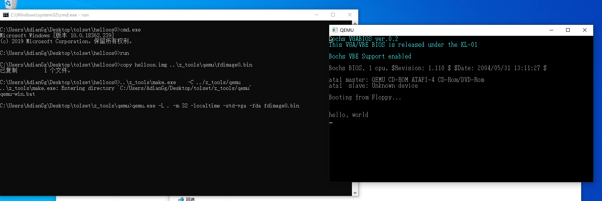
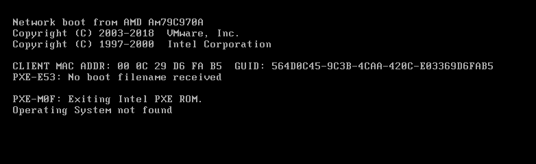
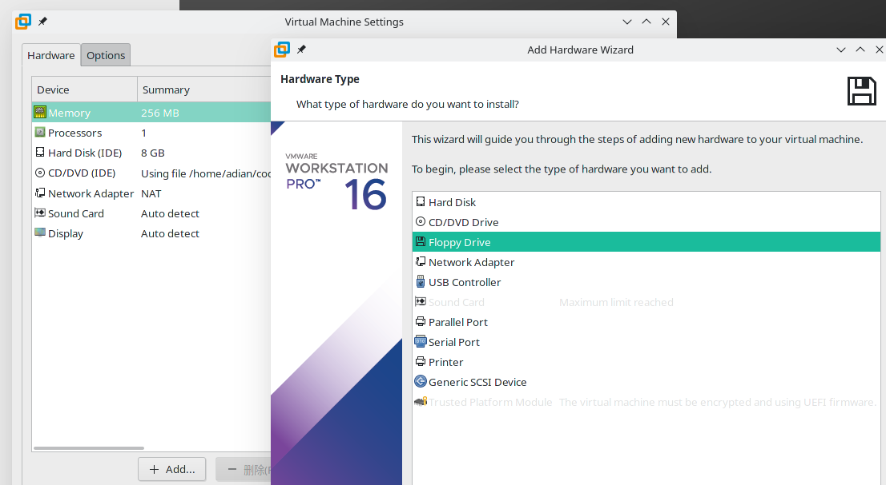
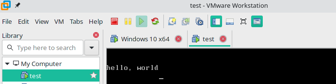

# 第一天

书籍的作者给出了helloos1.img的源码，并讲解了如何不使用软盘启动来调试Img镜像启动程序

## 如何使用img镜像启动虚拟机

光盘中给出的文件中有一个文件夹名称为`tolset(tool set工具集的缩写)`，作者暂时还没有讲tolset中是如何工作的，但是提到了使用了一个名为QEMU的虚拟机，给出了运行的步骤

### 具体步骤

1. 将给出的tolset文件夹复制到自己的开发路径中（任意位置，自己怎么舒服怎么来）

2. 将给出的project目录中的01_day中的所有文件复制到tolset目录下

3. 进入helloos0(或其他)目录中，打开`!cons_nt.bat`，执行`run`命令即可运行

输出helloworld的结果如图



### 补充尝试

因为个人使用Manjaro作为日常操作系统，WIndows上的操作不得不使用虚拟机，实在是麻烦的很，所以尝试直接用Vmware启动，很不幸，我失败了，Vmware提示找不到系统



我感觉可能就是引导的问题，然后发现人傻了，这个是软盘启动，然而我用的CD/DVD,于是在Setting中加入了Floppy Drive驱动




成功img启动虚拟机，这一下对Windows的依赖就小了很多



## 究竟做了什么

CPU(Central Process Unit中央处理单元)除了与其他电路进行电信号交换以外什么都不会，而且对于电信号，也只会理解开和关(1和0)

用0和1组合，就可以组合出其他的数字，字母，单词，这就是二进制(不记录了，太基础),在书上给出的源码中，里面的内容为16进制，转化之后就是helloworld这几个字母

## 汇编初体验

上文写了好多的helloworld用汇编语言，短短22行即可完成

	DB	0xeb, 0x4e, 0x90, 0x48, 0x45, 0x4c, 0x4c, 0x4f
	DB	0x49, 0x50, 0x4c, 0x00, 0x02, 0x01, 0x01, 0x00
	DB	0x02, 0xe0, 0x00, 0x40, 0x0b, 0xf0, 0x09, 0x00
	DB	0x12, 0x00, 0x02, 0x00, 0x00, 0x00, 0x00, 0x00
	DB	0x40, 0x0b, 0x00, 0x00, 0x00, 0x00, 0x29, 0xff
	DB	0xff, 0xff, 0xff, 0x48, 0x45, 0x4c, 0x4c, 0x4f
	DB	0x2d, 0x4f, 0x53, 0x20, 0x20, 0x20, 0x46, 0x41
	DB	0x54, 0x31, 0x32, 0x20, 0x20, 0x20, 0x00, 0x00
	RESB	16
	DB	0xb8, 0x00, 0x00, 0x8e, 0xd0, 0xbc, 0x00, 0x7c
	DB	0x8e, 0xd8, 0x8e, 0xc0, 0xbe, 0x74, 0x7c, 0x8a
	DB	0x04, 0x83, 0xc6, 0x01, 0x3c, 0x00, 0x74, 0x09
	DB	0xb4, 0x0e, 0xbb, 0x0f, 0x00, 0xcd, 0x10, 0xeb
	DB	0xee, 0xf4, 0xeb, 0xfd, 0x0a, 0x0a, 0x68, 0x65
	DB	0x6c, 0x6c, 0x6f, 0x2c, 0x20, 0x77, 0x6f, 0x72
	DB	0x6c, 0x64, 0x0a, 0x00, 0x00, 0x00, 0x00, 0x00
	RESB	368
	DB	0x00, 0x00, 0x00, 0x00, 0x00, 0x00, 0x55, 0xaa
	DB	0xf0, 0xff, 0xff, 0x00, 0x00, 0x00, 0x00, 0x00
	RESB	4600
	DB	0xf0, 0xff, 0xff, 0x00, 0x00, 0x00, 0x00, 0x00
	RESB	1469432

`DB`指令是`define byte`的缩写，也就是直接往文件里写1个字节的指令，这个指令是非常常用的，理论上来说，它可以写出任何数据，甚至可以直接写字符串

`DW`指令是`define word`的缩写，指16位，即两个字节

`DD`指令是`define double-word`的缩写，指32位，即四个字节

`RESB`指令是`reserve byte`的缩写，如果想要从现在的地址开始空出10个字节来，就可以写成RESB 10

`;`是汇编语言中的注释、

稍加润色，让程序有模有样

```
; hello-os
; TAB=4

; 以下这段是标准FAT12格式软盘专用的代码

		DB		0xeb, 0x4e, 0x90
		DB		"HELLOIPL"		; 启动区的名称可以是任意字符串(8位)
		DW		512				; 每个扇区的大小（必须为512）
		DB		1				; 簇的大小，必须为1
		DW		1				; FAT的起始位置
		DB		2				; FAT的个数（必须为2）
		DW		224				; 根目录的大小（一般设置为224）
		DW		2880			; 该磁盘的大小(必须是2880)
		DB		0xf0			; 磁盘的种类
		DW		9				; FAT的长度（必须是9）
		DW		18				; 1个磁道有几个扇区（必须是18）
		DW		2				; 磁头数（必须是2）
		DD		0				; 不使用分区，必须是0
		DD		2880			; 重写一次磁盘大小
		DB		0,0,0x29		; 意义不明 固定
		DD		0xffffffff		; 卷标号码
		DB		"HELLO-OS   "	; 磁盘的名称（11字节）
		DB		"FAT12   "		; 磁盘格式名称（8字节）
		RESB	18				; 先空出18字节

; 程序主体

		DB		0xb8, 0x00, 0x00, 0x8e, 0xd0, 0xbc, 0x00, 0x7c
		DB		0x8e, 0xd8, 0x8e, 0xc0, 0xbe, 0x74, 0x7c, 0x8a
		DB		0x04, 0x83, 0xc6, 0x01, 0x3c, 0x00, 0x74, 0x09
		DB		0xb4, 0x0e, 0xbb, 0x0f, 0x00, 0xcd, 0x10, 0xeb
		DB		0xee, 0xf4, 0xeb, 0xfd

; 信息显示部分

		DB		0x0a, 0x0a		; 2个换行
		DB		"hello, world"
		DB		0x0a			; 换行
		DB		0
	
		RESB	0x1fe-$			; 填写0x00直到0x001fe
	
		DB		0x55, 0xaa

; 以下是启动区以外部分的输出

		DB		0xf0, 0xff, 0xff, 0x00, 0x00, 0x00, 0x00, 0x00
		RESB	4600
		DB		0xf0, 0xff, 0xff, 0x00, 0x00, 0x00, 0x00, 0x00
		RESB	1469432
```

## 一些术语

### fat12格式

用Windows或者是DOS格式化出的软盘就是这种格式，兼容性好

### 启动区

软盘的第一个扇区称为启动区，计算机先读取第一个扇区，然后区检查这个扇区最后两个字节的内容，如果这最后两个自己字节不是0x55 AA,计算机会认为这张盘上没有所需的启动程序，就会报一个不能启动的错误

### 扇区

计算机读写软盘的时候，并不是一个字节一个字节的读取的，而是以512字节为一个单位进行读写，因此软盘的512字节就称为一个扇区

### IPL

initial program loader的缩写，启动程序加载器，启动区只有区区512字节，实际的操作系统不想helloos这么小，根本装不进去，所以几乎所有的操作系统都是吧加载操作系统本身的程序放在启动区里