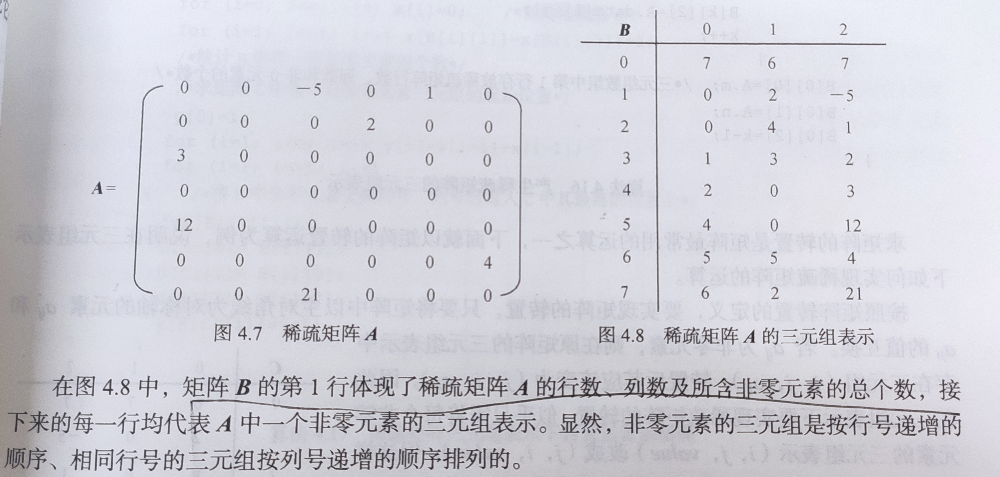

# 数据结构笔记

## 复习提纲


### 1、 顺序表插入、删除：算法2.7\2.8

```c
void insert(sequence_list *slt,datatype x,int position){
	int i;
	if (slt->size == MAXSIZE)
	{
		printf("\n顺序表是满的！无法插入！");
		exit(1);
	}
	if (position < 0 || position > slt->size)
	{
		printf("\n指定的插入位置不存在！");
		exit(1);
	}
	for (i = slt->size; i > position; i--)
	{
		slt->a[i] = slt->a[i-1];
	}
	slt->a[position] = x;
	slt->size++;
}

void dele(sequence_list *slt,datatype x,int position){
	int i;
	if (slt->size == MAXSIZE)
	{
		printf("\n顺序表是满的！无法插入！");
		exit(1);
	}
	if (position < 0 || position > slt->size)
	{
		printf("\n指定的插入位置不存在！");
		exit(1);
	}
	for (i = position; i < slt->size - 1; i++)
	{
		slt->a[i] = slt->a[i+1];
	}
	slt->size--;
}
```

### 2、 顺序栈的出入：算法2.12\2.13

```c
void push(sequence_stack *st,datatype x){
    if (st->top == MAXSIZE)
    {
        printf("\n is Full");
        exit(1);
    }
    st->a[st->top] = x;
    st->top++;
    
}

void pop(sequence_stack *st){
    if (st->top == 0)
    {
        printf("\nThe sequence stack is empty !");
        exit(1);
    }
    st->top--;
}
```


### 3、 顺序队列的出入：算法2.24\2.25

```c
void insert(sequece_queue *sq,datatype x){
	int i;
	if (sq->rear == MAXSIZE)
	{
		printf("\n顺序队列是满的！");
		exit(1);
	}
	sq->a[sq->rear] = x;
	sq->rear = sq->rear + 1;
}

void dele(sequece_queue *sq){
	if (sq->front == sq->rear)
	{
		printf("\n顺序队列是空的！");
		exit(1);
	}
	sq->font++;
}
```


### 4、 顺序循环队列的出入：算法2.26\2.27

```c
void insert_sequence_cqueue(sequence_queue *sq;datatype x){
    if ((sq->rear + 1) % MAXSIZE == sq->front)
    {
        printf("full");
        exit(1);
    }
    sq->a[sq-rear] = x;
    sq->rear = (sq->rear + 1) % MAXSIZE;

//rear+1如果是满的就是和front在同一个位置了，比maxsize要大，所以取余就是front的位置
    
}

void dele_sequence_cqueue(sequence_queue *sq){
    if (sq->front == sq->rear)
    {
        printf("empty");
        exit(1);
    }
    sq->front = (sq->front + 1) % MAXSIZE;
}
```


### 5、 单链表的插入、删除、输出：算法3.7\3.9\3.10

```c
void display(node *head){
	node *p;
	p = head->next;
	if (!p)
	{
		printf("\nempty!");
	}
	else
	{
		while(p){
			printf("%5d\n",p->info);
			p = p->next;
		}
	}
}


node *insert(node *head,datatype x,int i){
	node *p,*q;
	q = find(head,i);
	if (!q)
	{
		printf("\nno this node");
		return head;
	}
	p = (node*)malloc(sizeof(node));
	p->info = x;
	p->next = q->next;
	q->next = p;
	return head;
}

node *dele(node *head,datatype x){
	node *pre = head;
	node *q;
	q = head->next;
	while(q && q->info != x){
		pre = q;  
		q = q->next;
	}
	if (q)
	{
		pre->next = q->next;  //pre指向q的前驱 
		free(q);
	}
}
```


### 6、 二叉树的前中后三种递归遍历：算法7.1\7.2\7.3

```c
//前序

void preorder(bintree t){
	if (t)
	{
		printf("%c\n",t->data);
		preorder(t->lchild);
		preorder(t->rchild);
	}
}

//中序
void inorder(bintree t){
	if (t)
	{
		inorder(t->lchild);
		printf("%c\n",t->data);
		inorder(t->rchild);
	}
}

//后序
void postorder(bintree t){
	if (t)
	{
		postorder(t->lchild);
		postorder(t->rchild);
		printf("%c\n",t->data);
	}
}
```


### 7、 概念：数据结构相关内容、顺序表、单链表、栈、队列及其两种存储方式

**梳理：数据结构包含哪三个方面、每个方面又是什么含义P2-5**

三个方面：

- 数据的逻辑结构
- 数据的存储结构
  - 顺序存储
  - 链式存储
  - 索引存储
  - 散列存储
- 数据的运算集合

数据的逻辑结构是数据和数据之间所存在的逻辑关系

数据在计算机中的存储方式被称为数据的存储结构

数据的运算集合要视情况而定，一般包括插入，删除，检索，输出和排序等


**顺序表 概念P11，特点**

线性表采用顺序存储的方式存储就成为顺序表，顺序表是将表中的结点依次存放在计算机内存中一组地址连续的存储单元中

如果一个节点需要占用Len个内存单位

```
location(ki) = location(k1) + (i-1)len
```


**单链表：链式存储——内存不一定连续。带头结点或不带头结点  这两种的本质区别 P35 图3.3对比图3.6  P40**

> 头结点的数据域可以不存储任何信息，头结点的[指针](https://baike.baidu.com/item/指针)域存储指向第一个结点的指针（即第一个元素结点的存储位置）。头结点的作用是使所有[链表](https://baike.baidu.com/item/链表)（包括空表）的[头指针](https://baike.baidu.com/item/头指针/9794674)非空，并使对[单链表](https://baike.baidu.com/item/单链表)的插入、删除操作不需要区分是否为空表或是否在第一个位置进行，从而与其他位置的插入、删除操作一致。

带头节点可以对空的单链表插入新结点，删除结点后单链表成为空表等特殊情况进行处理


**栈的概念P16  两种存储方式 ，重点是顺序存储—— top的值 代表空或满**

插入和删除的一端称为栈顶，另一端为栈底

两种存储方式

- 顺序栈
- 链式栈

top代表的状态：

- st->top == 0;为空
- st->top == MAXSIZE;为满

**队列的概念P26  两种存储方式 ，重点是顺序存储——（循环与不循环之分）front和rear  什么状态代表是空的，什么状态代表满的。**

 队列

- 顺序队列
- 循环队列

顺序队列：

- sq->rear == MAXSIZE；为满
- sq->front == sq->rear;为空
  循环队列

- （rear+1）% MAXSIZE == front;为满
- rear == front;为空

### 8、 算法和程序的特征、时间复杂度和空间复杂度的概念

算法满足以下五个特征：

- 有穷性 
- 确定性
- 输入
- 输出
- 可行性

程序是用计算机语言表达的求解一个问题的一系列指令的序列。他和算法的主要区别是，算法具有有穷性。一般的程序都会在有限时间内终止，但有的程序却可以不在有限的时间内终止。如一个操作系统在正常情况下永远都不会终止。

O()速查表

| O(N)       | 量级   |
| ---------- | ------ |
| O(1)       | 常数阶 |
| O(n)       | 线性阶 |
| O(n方)     | 平方阶 |
| O(n三次方) | 立方阶 |

O(N)相等，则复杂度相等，其他因素可以忽略

### 9、 出栈序列的推理  后进先出

进栈顺序为A、B、C、D，在进栈过程中可以出栈，请找出哪一个不可能(d)

a、CDBA

b、ABCD

c、ACDB

d、ADBC

 

### 10、 循环队列中元素个数的计算、满的条件、空的条件

（rear-front+ MAXSIZE）% MAXSIZE——  个数

满——算法2.26里的if条件    (rear+1)%MAXSIZE == front

空——算法2.27里的if条件    rear == front

### 11、 顺序队列中元素个数的计算、满的条件、空的条件

rear-front  ——  个数

满——算法2.24里的if条件    rear == MAXSIZE

空——算法2.25里的if条件    front == rear

 

### 12、 二维数组存储地址的计算——基地址+前有多少个*单位字节

不压缩
$$
address(aij) = address(a00) + (i * n + j)
$$
对称压缩存储

**i >= j**(L为一个元素所占用的地址空间，通常是1)
$$
address(aij) = address + (i * (i + 1) /2 + j ) * L
$$
**i < j**
$$
address(aij) = address + (j * (j + 1) /2 + i ) * L
$$


P93   4.2  对称需要压缩存储  计算a65地址  （前有i行等腰直角三角形，左有j个）

```
00                  //1
10 11               //2
20 21 22			//3
30 31 32 33			//4
40 41 42 43 44		//5
50 51 52 53 54 55	//6
60 61 62 63 64 65 66//6

1+2+3+4+5+6+6 = 27
```

​    变形：对称不压缩存储  计算a65的地址  （前有i行矩形，左有j个）

```
00 01 02 03 04 ---  09  //10
10 11 12 13 14 ---  19	//10
20 21 22 23 24 ---  29	//10
--
50 51 52 53 54 ---  59 	//10
60 61 62 63 64 65

6 x 10 + 5 = 65
```


### 13、 稀疏矩阵压缩的概念、存储方式

由于稀疏矩阵中零元素的个数很多，如按一般的矩阵存储方法加以存储，必然浪费大量的空间。为了节省存储单元，通常只存储矩阵中的非零元素，但也往往因此失去矩阵随机存取的优势；另外，由于稀疏矩阵中非零元素的分布不像对称矩阵、三角矩阵和带状矩阵那样呈现一定的规律性，因此存储其非零元素时必须增加一些附加信息加以辅助。

存储方式两种：

- 顺序存储：三元组顺序表



- 链式存储：十字链表


​		

### 14、 树的基本概念、树的遍历方法

存储P112-116：

- 双亲表示法
- 孩子表示法（数组）
- 孩子链表表示法
- 孩子兄弟表示法


遍历：

- 前序
- 后序
- 层次

 

### 15、 二叉树的性质

基本概念

**二叉树**：二叉树是每个节点最多有两个子树的树结构。

**根节点**：一棵树最上面的节点称为根节点。

**父节点**、**子节点**：如果一个节点下面连接多个节点，那么该节点称为父节点，它下面的节点称为子 节点。

**叶子节点**：没有任何子节点的节点称为叶子节点。

**兄弟节点**：具有相同父节点的节点互称为兄弟节点。

**节点度**：节点拥有的子树数

**树的深度**：从根节点开始（其深度为0）**自顶向下**逐层累加的。

**树的度：**所有节点度中的最大值

**树的高度**：从叶子节点开始（其高度为0）**自底向上**逐层累加的。

**层数：**从根结点记为1层，逐层+1

### 性质

- 一棵非空二叉树的第i层上至多有2的i-1次个节点
- 深度为h的二叉树址多有2的h次-1个节点
- 对于任何一棵二叉树T，如果其终端节点数为n0，度为2的结点数为n2，则n0 = n2 + 1
- 一棵深度为k且有2的k次-1个结点的二叉树称为满二叉树。
- 完全二叉树的叶子节点只出现在最后两层，且都靠左对其


二叉树的存储：一般二叉树的顺序存储、完全二叉树的顺序存储、二叉链表

二叉树的遍历：前序、中序、后序    

两种：由树得序列、由序列得树

 

### 16、 图的基本概念、图的存储、图的两种遍历方法、图最小生成树的概念

概念P146-148

存储：邻接矩阵（有向无向、带权或不带权）P184  图8.36~8.37，图8.39-图8.40

​    P 151 图 8.9  不带权  图8.20 带权（***\*统一按教材，主对角线为0\****）

   邻接表（有向无向、带权或不带权）P184 图8.38  P154图8.11

遍历：DFS、BFS

最小生成树的概念：  肯定是带权、连通    包含的顶点数与边的数量的关系

最小生成树的算法：（1）普里姆（prim）P164 图8.21（虚线存在问题）

 

（d）图用刀一切，切到两条最小权值的边均为6，选取任意一条即可。

最小生成树的算法：（2）克鲁斯卡尔（kruskal）P166 图8.23

 

### 17、 顺序检索成功与不成功时比较次数、ASL

静态检索——线性表的检索

（1） 顺序检索：算法P187，   P188 （9-2）成功时的ASL，(9-3)不成功时的比较次数

（2） 二分检索：算法P190-191，   P191，（9-6）ASL

（3） 分块检索：算法P192，   P193 （9-7）需要修改、（9-8）

动态检索——9.3节9.4节 （未讲）

### 18、 二分检索时查找某关键字时所需的比较次数的计算 P230第一个选择题  B

以key = 45举例，  后两个关键字请自行推理

（1） L = 0，H = 8à M = (0+8)/2 = 4  data[M]>key，所以45在左半区 à H=M-1=3

（2） L= 0，H=3 àM = (0+3)/2 = 1  data[M]<key  所以45在右半区  àL = M+1 = 2

（3） L = 2，H = 3àM =(2+3)/2 = 2  data[M] <key 所以45在右半区  àL = M+1 =3

（4） L = 3, H = 3 àM =    =3   data[3] == key  找到了

结论：比较了几次  4次  

 

 

### 综合应用：

1、 树：存储结构P112-116、树与二叉树相互转换P143 图7.9~7.11

2、二叉树：由2种遍历序列反推树，并得到第三种遍历序列  P145  7.7  7.10

3、赫夫曼树及编码 ：P231  9.10  8 改成7  要求画 左大右小的Huffman树，得到每个字符的Huffman编码 左1右0。

4、图的存储两种及最小生成树的两种生成算法 


