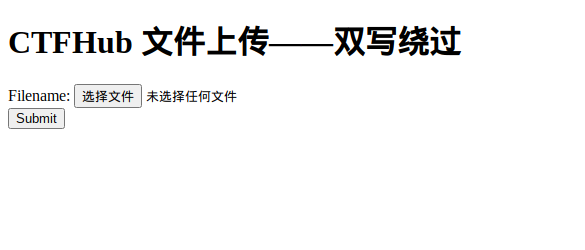

# CTFHUB_双写后缀

## 题目内容




## WriteUp

html中注释给出了一些内容

```
$name = basename($_FILES['file']['name']);
$blacklist = array("php", "php5", "php4", "php3", "phtml", "pht", "jsp", "jspa", "jspx", "jsw", "jsv", "jspf", "jtml", "asp", "aspx", "asa", "asax", "ascx", "ashx", "asmx", "cer", "swf", "htaccess", "ini");
$name = str_ireplace($blacklist, "", $name);
```

代码直接将黑名单中的后缀替换成了空，也就是删除了

但是只做了一次，所以我们把后缀改成.pphphp,这样删除了一个php正好还有一个php

经过尝试，上传成功

