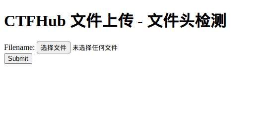

# CTFHUB_eval执行

## 题目内容




## WriteUp

文件头检查，顾名思义，就是检查文件头是否合法，所以直接上图片马就可以，因为图片马的文件头是图片合法

但是直接上传.php会被拦截，并且.htaccess文件无法上传，不在白名单中，所以还是抓包00截断，抓包发现，还是检测的mime头，更改后成功

看一手源代码

```php
if (!empty($_POST['submit'])) {
    if (!$_FILES['file']['size']) {
        echo "<script>alert('请添加上传文件')</script>";
    } else {
        $file = fopen($_FILES['file']['tmp_name'], "rb");
        $bin = fread($file, 4);
        fclose($file);
        if (!in_array($_FILES['file']['type'], ["image/jpeg", "image/jpg", "image/png", "image/gif"])) {
            echo "<script>alert('文件类型不正确, 只允许上传 jpeg jpg png gif 类型的文件')</script>";
        } else if (!in_array(bin2hex($bin), ["89504E47", "FFD8FFE0", "47494638"])) {
            echo "<script>alert('文件错误')</script>";
        } else {
            $name = basename($_FILES['file']['name']);
            if (move_uploaded_file($_FILES['file']['tmp_name'], UPLOAD_PATH . $name)) {
                echo "<script>alert('上传成功')</script>";
                echo "上传文件相对路径<br>" . UPLOAD_URL_PATH . $name;
            } else {
                echo "<script>alert('上传失败')</script>";
            }
        }
    }
}
```


