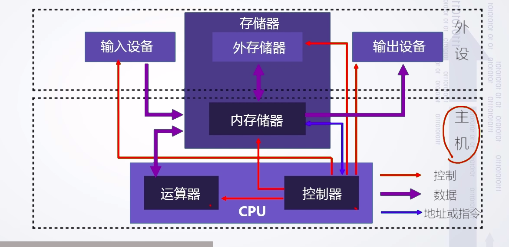
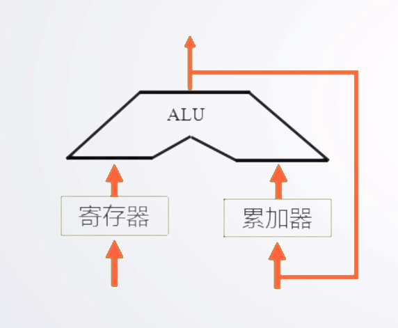
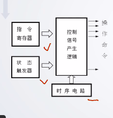

# 1.1冯诺依曼结构原理及层次结构分析

## 冯诺依曼计算机的工作原理

### 存储程序

将程序存放在计算机的存储器中

### 程序控制

按指令地址访问存储器并取出指令，经译码器依次产生指令执行所需要的控制信号，实现对计算的控制，完成指令的功能

## 冯诺依曼的计算机组成

**主机**

CPU(运算器+控制器)、内存

**外设**

输入设备、外存储器、输出设备

**总线**

地址线、数据线、控制线

### 硬件系统

#### 运算器

- 算数运算（加、减、乘、除）
- 逻辑运算（与、或、非、移位）
- 基本结构（ALU）

 寄存器存储运算的数据，累加器保存运算的结果，累加器也是一种寄存器

#### 控制器

产生指令在执行过程中的所有控制信号

- 电平信号
- 脉冲信号

产生依据

- 指令
- 状态
- 时序

产生方式

- 微程序
- 硬布线

#### 存储器

基本结构

- 地址总线
- 数据总线
- 存储体

功能

- 存储原程序
- 存储原数据
- 存储运算中间结果

工作模式

- 读
- 写

容量与地址线数量关系

| 容量 | 地址线数量 |
| ---- | ---------- |
| 1K   | 10         |
| 1M   | 20         |
| 1G   | 30         |

#### 输入、输出设备

输入设备：向计算机输入数据（键盘、鼠标、网卡、扫描仪等）

输出结果：输出处理结果（显示器、声卡，网卡、打印机等）

### 软件系统

- 软件是可运行的思想和内容的数字化
  - 思想：算法、规律、方法---程序表达
  - 内容：图形、图像、数据、声音、文字等被处理的对象
- 软件的表现形式：程序和数据的集合 （二进制 ）
- 软件的核心：算法

分类

- 系统软件（操作系统、网络系统、编译系统）
- 支撑软件（开发工具等）
- 应用软件

## 硬件和软件的关系

- 相互依存
- 逻辑等效
- 协同发展

## 计算机的层次结构

1. 应用程序
2. 高级语言
3. 汇编语言
4. 操作系统
5. 指令集架构层
6. 微代码层
7. 硬件逻辑层

- 不同用户在不同层次
- 不同层次具有不同属性

软硬件的分界线在指令集架构层，上面是软件，下面是硬件，指令格式和指令的设计与硬件关联