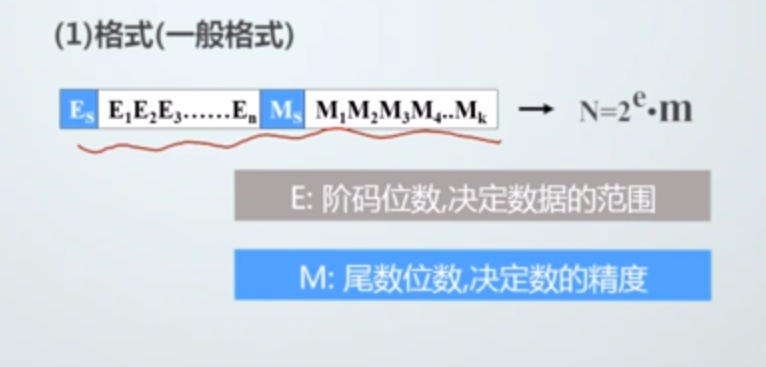

# 2.2定点与浮点数表示

## 定点数据表示

可以表示定点小数和证书（小数点固定）

**表现形式**

X0.X1X2X3X4 定点小数

X0X1X2X3X4. 定点整数

定点小数的表示范围(补码)-1<=x<=1-2^-n

定点整数的表示范围(补码)-2^n <= x <=2^n -1

定点数据表示数的不足：数据表示的范围受限制（收到字长的制约）

## 浮点数据表示

把数的范围和精度分别表示的一种数据表示方法

**使用场合：** 数的表示的表示范围超出了定点数表示的范围

**格式**

一般表示格式的不足：数据移植性太差，无法形成约定

不足解决方案:IEEE 754格式

| IEEE 745 |       |       |        |
| -------- | ----- | ----- | ------ |
| S        | 8位E  | 23位M | 单精度 |
| S        | 11位E | 52位M | 双精度 |

