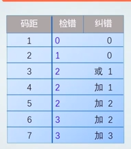

# 2.3 数据校验的基本原理

## 数据校验的必要性

- 受元器件的质量、电路故障、或噪音干扰等因素的影响，数据在被处理、传输、存储的过程中可能出现错误
- 若能设计硬件层面的错误检测机制，可以减少基于软件检错的代价

## 校验的基本原理

**增加冗余码**（校验位）

有效信息(k位)校验信息(r位)

## 码距的概念

- 同一编码中，任意两个合法编码之间不同的二进制位数的最小值
- 0011和0001的码距为1，一位错误时无法识别
- 一旦改变，码距改变则会被识别出错误
- 校验码中增加冗余项的目的就是增大码距

## 码距与检错或纠错能力的关系

- 码距>=e + 1时可检测e个错误
- 码距>=2t+1时可纠正t个错误
- 码距>= e + t + 1时可纠正t个错误，同时检测e个错误(e >= t)

## 选择码距要考虑的因素

- 码距越大，抗干扰能力越强，纠错能力越强，数据冗余越大，编码效率低，编码电路也相对复杂
- 选择码距必须考虑信息发生差错的概率和系统能容许的大小

