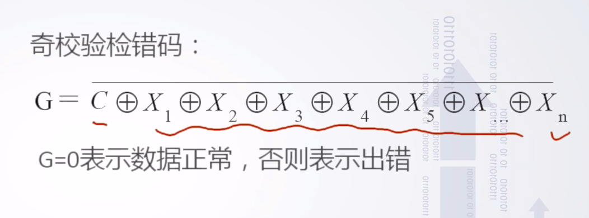

# 2.4奇偶校验

## 奇偶校验的基本原理

1. 增加冗余码（有效信息k位，校验信息1位）
2. 编码：根据有效信息计算校验信息位，时校验码中的1的个数满足奇/偶校验的要求

0001->00011(偶校验)，校验位为1使得1的个数为偶数个

0001->00010(奇校验)，校验位为0使得1的个数为奇数个

  3.检验错误与电路

## 奇偶校验的特点

- 编码与检错简单
- 编码效率高
- 是一种错误检测校验，只可以检测错误，但是无法判断是否正确，结论不可靠
- 不能定位错误，不能纠正错误

## 改进的奇偶校验

- 双向奇偶校验
- 方块校验
- 垂直水平校验

## 关于奇偶校验应用的讨论

应用场合：内存数据校验（偶数位内存条不适用）

一般在同步传输中采用奇校验，在异步传输中采用偶校验