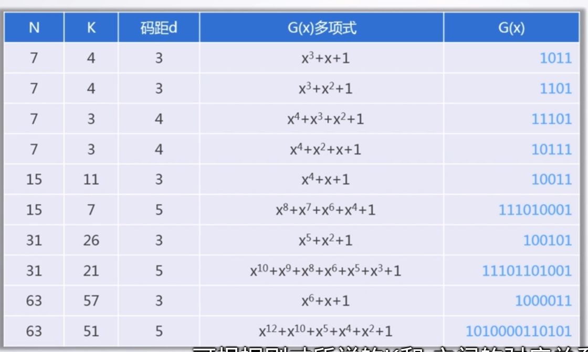
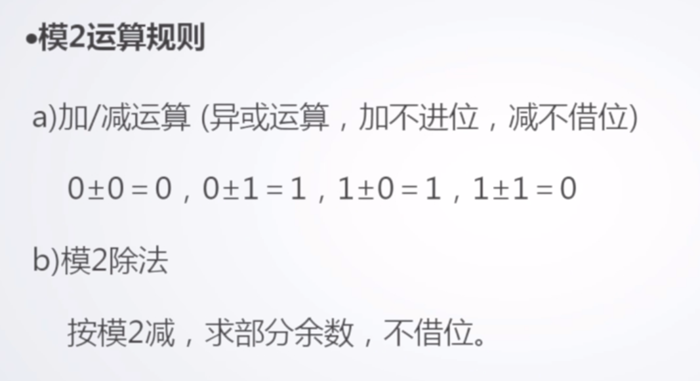
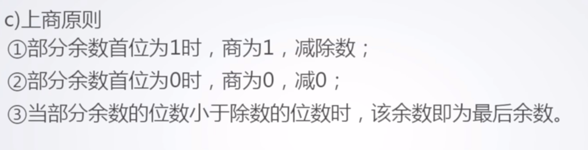

# 2.5CRC校验及其实现

## CRC校验的基本原理

**增加冗余位**

有效信息k位，校验信息r位

$$
N = k + r <= 2^r - 1
$$

**生成多项式**

收发双方约定的一个(r+1)位二进制数，发送方利用G(x)对信息多项式做模2除运算，生成校验码，接收方利用G(x)对收到的编码多项式做模2除运算检测差错及错误定位

**G(x)应满足的条件**

1. 最高位和最低位必须为1
2. 档被传送信息(CRC码)任何一位发生错误时，被生成多项式作除后应该使余数不为0
3. 不同位发生错误时，模2除运算后余数不同
4. 对不为0余数继续进行模2除运算应使余数循环

CRC又叫做循环冗余校验

**常见生成多项式**

**模2运算规则**

